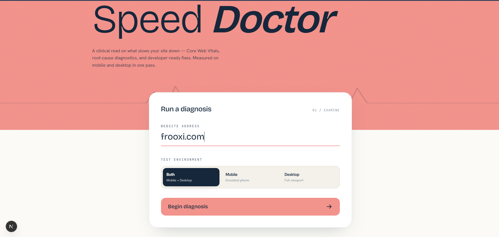
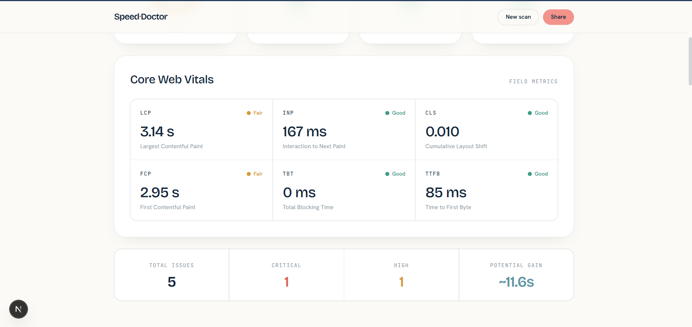
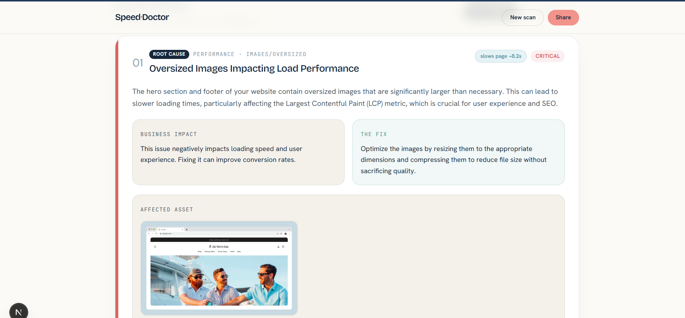

<div align="center">

# 🩺 Speed Doctor

**Open-source website performance diagnostics — Lighthouse metrics, real DOM analysis, and AI root-cause fixes in one report.**

[Documentation](#-documentation) · [Quick start](#-quick-start) · [Why scores differ from PSI](#-why-scores-differ-from-pagespeed-insights) · [Contributing](#-contributing)

</div>

> ℹ️ **Personalize me:** replace `your-username` (and the repo name if different) throughout this file, and update `apps/web/lib/site.ts` with your GitHub, name and Buy-Me-a-Coffee link.

🔗 **GitHub Profile:** [dev-tanvu](https://github.com/dev-tanvu) | **Repository:** [Speed-Doctor](https://github.com/dev-tanvu/Speed-Doctor)

---

## 📸 Screenshots

### Home Page


### Audit Dashboard


### Issue Details


---

## ✨ Features

- **Mobile + Desktop in one pass** — audit both form factors at once, like PageSpeed Insights, with device tabs in the report.
- **Real browser scan** — Playwright loads the page in actual Chromium and captures HTML, assets and timings.
- **Core Web Vitals** — Lighthouse-measured LCP, INP, CLS, FCP, TBT and TTFB.
- **Six DOM detectors** — oversized images, unoptimized fonts, heavy/render-blocking JS, video bloat, third-party weight and DOM size.
- **Root-cause ranking** — issues are correlated to the metrics they hurt and ranked by impact.
- **Plain-English & developer views** — every issue explains the business impact *and* ships a code fix.
- **Live progress** — real-time audit progress over Server-Sent Events.
- **Self-hostable & free** — bring your own database, Redis and (optional) AI key.

## 🏗️ Architecture

A [pnpm](https://pnpm.io) + [Turborepo](https://turbo.build) monorepo:

```
apps/
  web/      Next.js 15 front-end (this site)
  api/      NestJS + Fastify REST API (accepts audits, streams progress via SSE)
  worker/   NestJS worker — runs the scan pipeline off a BullMQ queue
packages/
  scanner/           Playwright page scanner (with SSRF protection)
  lighthouse-engine/ Lighthouse runner (isolated child process)
  dom-analyzer/      Six DOM issue detectors
  root-cause-engine/ Correlates issues to affected metrics
  priority-engine/   Ranks issues and assembles the report
  ai-engine/         OpenRouter explanations (+ template fallback)
  db/                Drizzle ORM schema + client (PostgreSQL)
  queue/             BullMQ + Redis client
  shared-types/      Shared TypeScript types
```

**Flow:** `URL → API creates run → BullMQ → worker (scan → Lighthouse → DOM analysis → correlate → AI) → PostgreSQL → report`.

## 🧰 Tech stack

Next.js · React · Tailwind CSS · NestJS · Fastify · BullMQ · Redis · Playwright · Lighthouse · Drizzle ORM · PostgreSQL · OpenRouter · TypeScript.

## 📋 Prerequisites

- **Node.js 20+** and **pnpm 11+** (`corepack enable` provisions pnpm)
- A **PostgreSQL** database — [Neon](https://neon.tech) free tier works
- A **Redis** instance — [Upstash](https://upstash.com) or the bundled Docker service
- **Chrome/Chromium** — installed by Playwright; required by the worker
- *Optional:* an [OpenRouter](https://openrouter.ai/keys) API key for AI explanations

## 🚀 Quick start

```bash
# 1. Clone & install
git clone https://github.com/dev-tanvu/Speed-Doctor.git
cd Speed-Doctor
pnpm install

# 2. Configure environment
cp .env.example .env          # Windows: copy .env.example .env
#   → fill in DATABASE_URL, REDIS_URL, (optional) OPENROUTER_API_KEY

# 3. Start Redis (skip if using Upstash)
docker compose up -d redis

# 4. Create the database schema
pnpm --filter @speed-doctor/db exec drizzle-kit push

# 5. Run web + API + worker together
pnpm dev
```

- Web → http://localhost:3000
- API → http://localhost:3001

## 🔑 Environment variables

| Variable | Required | Purpose |
| --- | --- | --- |
| `DATABASE_URL` | ✅ | Postgres connection string (`?sslmode=require` for Neon) |
| `REDIS_URL` | ✅ | Redis connection (`rediss://` for Upstash TLS) |
| `NEXT_PUBLIC_API_URL` | ✅ | Public API URL the browser calls |
| `OPENROUTER_API_KEY` | ➖ | Enables AI explanations (templates used if unset) |
| `OPENROUTER_MODEL` | ➖ | Model override (default `openai/gpt-4o-mini`) |
| `WORKER_CONCURRENCY` | ➖ | Concurrent audits per worker (default `1`) |
| `ALLOWED_ORIGINS` | ➖ | CORS allowlist (default `http://localhost:3000`) |
| `RATE_LIMIT_MAX` | ➖ | Audit requests per IP per minute (default `10`) |

> 🔒 Secrets live only in `.env` (git-ignored). Commit changes to `.env.example` instead. See [SECURITY.md](./SECURITY.md).

## 📜 Scripts

| Command | Description |
| --- | --- |
| `pnpm dev` | Run all apps in dev (Turborepo) |
| `pnpm build` | Build every app and package |
| `pnpm typecheck` | Type-check the whole monorepo |
| `pnpm lint` | Lint where configured |
| `pnpm format` | Prettier the codebase |

## ☁️ Deployment

**Front-end → Vercel.** Import the repo, set the project root to `apps/web`, add `NEXT_PUBLIC_API_URL`, and Vercel auto-builds on every push.

> ⚠️ **The API and worker cannot run on Vercel.** The worker is long-running and launches real Chrome (Playwright + Lighthouse), so deploy `apps/api` and `apps/worker` to a Node host — **Railway, Render, Fly.io or a VPS** — alongside managed Redis (Upstash) and Postgres (Neon). Point the Vercel front-end at the API via `NEXT_PUBLIC_API_URL`, and add your web origin to the API's `ALLOWED_ORIGINS`.

## 📚 Documentation

Full docs are built into the app at **`/docs`** (install, usage, pipeline, deployment, troubleshooting).

## 🎯 Why scores differ from PageSpeed Insights

Speed Doctor and Google PSI both run Lighthouse, but differ in hardware, network location, throttling model, Lighthouse version, run count, and lab-vs-field data — so scores won't match exactly. That's expected. Read the full explanation at **`/accuracy`**. Use Speed Doctor to find *what* to fix and track your trend; use PSI for the official score and real-user field data.

## 🤝 Contributing

PRs welcome! See [CONTRIBUTING.md](./CONTRIBUTING.md) and the [Code of Conduct](./CODE_OF_CONDUCT.md). Good places to start are the open [issues](https://github.com/dev-tanvu/Speed-Doctor/issues).

## ☕ Support

If Speed Doctor saves you time, consider [buying me a coffee](https://supportkori.com/tanviralmas) or starring the repo — it genuinely helps.

## 📄 License

[MIT](./LICENSE) © Tanvir Almas
